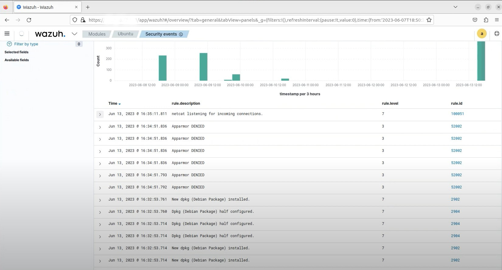

# Wazuh Deployment Project

This project demonstrates the deployment and configuration of **Wazuh** as a Security Information and Event Management (SIEM) system and Host-based Intrusion Detection System (HIDS). It includes config files, automation scripts, alert samples, and dashboard screenshots for reference and reproducibility.

---

##  Features
- Wazuh Manager & Agent setup (on Linux)
- Custom alert rules and log collection
- Sample integration with Suricata and Cowrie
- Kibana/OpenSearch dashboard visualizations
- Auto-installation script for quick deployment

---

##  Project Structure

- `configuration/` – Wazuh Manager and Agent configuration files 
- `alerts/` – Sample alerts captured during malware and rule testing 
- `screenshot/` – Dashboards and alert views for visibility 
- `scripts/` – Automated installation and setup scripts 
- `wazuh-installation-guide.md` – Step-by-step deployment instructions 

---


##  Screenshots

A collection of real-world detections and monitoring events using Wazuh:

---

##  Blocking Malicious IPs  
Wazuh blocks known malicious IP addresses to prevent external attacks. 


---

##  Detecting Brute Force Attack  
Monitors multiple failed login attempts and triggers alerts. 


---

##  Detecting Hidden Processes  
Reveals stealthy or hidden processes trying to evade detection. 


---

##  Malware Detection via VirusTotal  
Wazuh integrates with VirusTotal to verify suspicious files. 


---

##  Shellshock Exploit Detection  
Detects attempts to exploit Bash vulnerabilities like Shellshock. 


---

##  Unauthorized Process Execution  
Alerts on the execution of non-whitelisted or suspicious processes. 


---

##  File Integrity Monitoring  
Detects unauthorized changes to critical system files. 


---

##  Monitoring Malicious Command Execution  
Tracks execution of known malicious or suspicious commands. 


---

##  Docker Event Monitoring  
Observes security-relevant Docker events. 


---

##  SQL Injection Attack Detection  
Alerts on patterns related to SQL injection attempts. 


---

##  Vulnerability Detection  
Detects known software vulnerabilities based on CVEs. 


---


##  Getting Started

```bash
git clone https://github.com/your-username/wazuh-deployment.git
cd wazuh-deployment
bash scripts/install_wazuh.sh
```

---

##  License

This project is licensed under the [MIT License](LICENSE). 
You are free to use, modify, and distribute it with attribution.


---

##  Author

**Ijaz Ahmad** 
Cybersecurity Engineer | Blue Team Specialist 
📧 Email: ijazahmadafridicis11@gmail.com 
🌐 [LinkedIn Profile] https://linkedin.com/in/ijaz-ahmad-afridi
